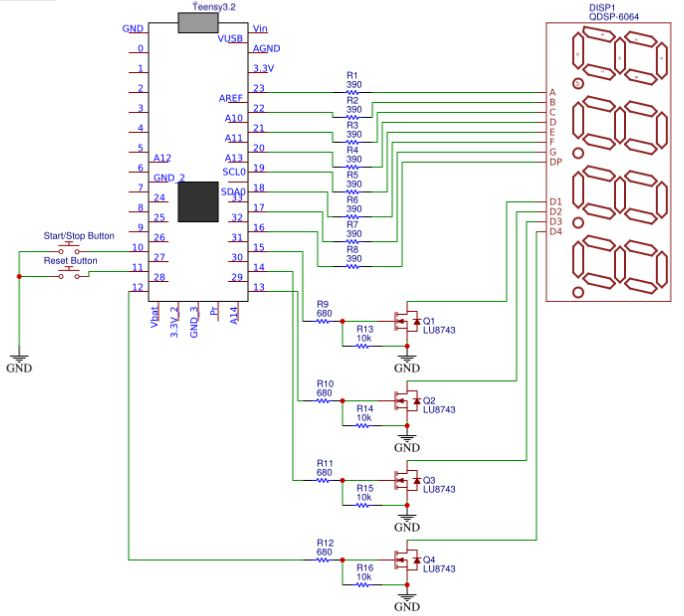
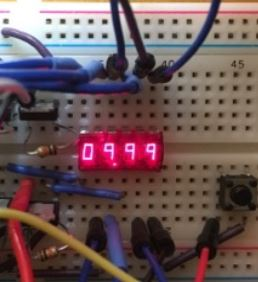

# ABSTRACT

# INTRODUCTION

The purpose of this project is to design and implement an embedded electronic system based stop watch.

The following minimum features are required:

- A button prompted stop watch 'reset' command. 
- A button prompted stop watch 'stop' and 'start' command.
- A bubble display that shows elapsed time in increments of 1/100 s (10 ms).

The following conditions must be satisfied:
- Timer precision, 10 ms (1/100 s) max deviation within a 10 s timespan.
- Proof of button debouncing functionality.
- No delay() function used.
- Use of external interrupts.
- Use of MOSFETS to compensate for the microcontroller's limited current source and sink capability.

# METHODOLOGY

## Circuit Design and Schematic

The bubble display stop watch circuit schematic is shown below:




A brief explanation of the circuit design follows:
- The momentary push buttons (Start/Stop and Reset) activate softare interrupts by pulling microcontroller pins 10 and 11 to ground. These pins are internally pulled up to prevent them from floating.
- Resistors R1 to R8 limit the current drawn through each of the 8 anode display segments on the bubble display, protecting the microcontroller.
- Microntroller pins 16 to 23 drive which anode segment lights up on the QDSP-6064 bubble display (A to DP). These pins determine what number is displayed.
- Microcontroller pins 12 to 15 drive enhancement LU8743 N-FETS Q1 to Q4 to activate the 4 bubble digit display slots sequentially. This is achieved by sending a voltage to the gate of the N-FET, causing the the N-FET to conduct current from the corresponding digit slot's common cathode. This completes the circuit with the anode segments by sinking the current to ground, displaying a number at a particular digit slot.
- N-FETS are utilized to protect excessive current sinking on the microcontroller, which can be the case when all anode segments are high (such as for the number '8.'). Each anode segment draws about 5 mA - having all 8 activated will require a current of 40 mA to be sunk which cannot be accomodated by the microcontroller.
- Resistors R9 to R12 lmit the current drawn from microcontroller pins 12 to 15 as voltage builds up on the N-FET gate.
- Resistors R13 to R16 ensures that the N-FET stops conducting to ground as soon as its corresponding microcontroller gate pin goes low. The resistor provides a path through which the voltage built up on the gate can be dissipated, shutting off the N-FET. A relatively high resistor value is needed to divert current from the microcontroller pin away from ground and towards the gate when a pin goes high.
-


## Program Design

The stop watch program is composed of 3 core activities:
- 4 Digit Number Display
- Time Tracking
- Time Start/Stop and Reset 

### 4 Digit Number Display


|Number          |Active Segments                |
|----------------|-------------------------------|
|0|abcdef   |
|1|bc       |
|2|abged    |
|3|abgcd    |
|4|fbgc     |
|5|afgcd    |
|6|afgecd   |
|7|abc      |
|8|afbgecd  |
|9|afbgc    |

# RESULTS

## Precision of 10 ms (1/100 s) max deviation within a 10 s timespan.

The code was altered to force the stop watch to stop when the millis() function reaches 10,000 ms:

```c
//If-Then block handling start/stop functionality.
  if (stopped_state_flag == false && millis() < 10000)
  {
    millis_value_at_stop_serially_printed = false;
    bubble_print(elapsed_time_ms);
    elapsed_time_at_stop_ms = elapsed_time_ms;
  }

  else if (stopped_state_flag == true || millis() >= 10000) // Force stop watch to stop when millis reaches 10000 ms.
  {
    
    
    //Serially print millis() function value if it hasn't been already for comparison with displayed time on bubble display.
    if (millis_value_at_stop_serially_printed == false){
      
      Serial.println(millis());
      millis_value_at_stop_serially_printed = true;

    }

    else {}

    stopped_state_flag = true;
    time_restart_compensation_ms = (millis() / 10) - elapsed_time_at_stop_ms - time_reset_compensation_ms;
    bubble_print(elapsed_time_at_stop_ms);
    
  }
``` 

The millis() function value was printed serially in milliseconds:


Comparing this to the time in seconds displayed on the bubble display:





# DISCUSSION AND CONCLUSION

We see that a deviation of no more 10 ms within a 10 seconds timespan was achieved as required. The testing method employed was more precise than the simpler approach of using another external stop watch as a reference. This is because it is virtualy impossible to stop the bubble display stop watch and an external reference stop watch at exactly the same time.

# REFERENCES

https://arduino.stackexchange.com/questions/28092/how-do-i-split-a-number-into-individual-digits


