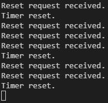
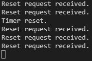

# WelTec Embedded Systems Project 1 - Bubble Display
By Christian Alexis Luz

# ABSTRACT
A reliable and precise stop watch was developed using a Teensy 3.2 development board paired with a QDSP-6064 bubble display and other electronic components. 

The stop watch displayed time elapsed in seconds in the format xx.xx s (up to 99.99 s) with a resolution of 1/100th of a second (10 ms). Button enabled start/stop and reset functionality was also successfully implemented. The stop watch then resets back to 00.00 s after exceeding 99.99 s on the bubble display.

In a 10 second time timespan, the stop watch was found to deviate by no more that 10 ms as required by the project requirements brief.

Debouncing of start/stop and reset buttons was also successfully implemented within the software, ensuring predictable system operation.

Lastly, supporting electronic components which include resistors and N-FET MOSFETs were selected based on datasheets to ensure that sensitive components are protected from excessive current flows.

# INTRODUCTION

The objective of this project is to design and implement an embedded electronic system based stop watch.

For this purpose, a Teensy 3.2 development board will be utilized to drive a QDSP-6064 bubble display to display time elapsed in seconds. Device inputs includes 2 buttons, one for starting/stopping the stop watch and one for resetting it.

The following minimum features are required:

- A button prompted stop watch 'reset' command. 
- A button prompted stop watch 'stop' and 'start' command.
- A bubble display that shows elapsed time in increments of 1/100th of a second (10 ms resolution).

The following conditions must be satisfied:
- Timer precision, 10 ms (1/100 s) max deviation within a 10 s timespan. For this requirement to be satisfied with 4 available digit slots on the bubble display, the maximum time elapsed to be displayed is 99.99 s.
- Proof of button debouncing functionality.
- No 'delay()' function used.
- Use of external interrupts.
- Use of MOSFETS to compensate for the microcontroller's limited current source and sink capability.

# METHODOLOGY

## Circuit Design and Schematic

The bubble display stop watch circuit schematic is shown below:


The Teensy 3.2's digital pins are noted to have an output of 3.3 V and 10 mA (PJRC, n.d.).

A brief explanation of the circuit design follows:
- The momentary push buttons (Start/Stop and Reset) activate softare interrupts by pulling microcontroller pins 10 and 11 to ground. These pins are internally pulled up to prevent them from floating.
- Resistors R1 to R8 limit the current drawn through each of the 8 anode display segments on the bubble display. Each anode segment has a max average current of 5 mA, with a typical voltage drop of 1.6 V (Hewlett Packard, n.d.).
>(3.3 V- 1.6 V) / 390 ohms = 4.36 mA, satisfying the Teensy's 10 mA and bubble display's 5 mA current limit.
- Microntroller pins 16 to 23 drive which anode segment lights up on the QDSP-6064 bubble display (A to DP). These pins determine what number is displayed. A bubble display pinout guide is illustrated below (Malinowo, 2015):


- Microcontroller pins 12 to 15 drive enhancement LU8743 N-FETs Q1 to Q4 to activate the 4 bubble digit display slots sequentially. This is achieved by sending a voltage to the gate of the N-FET, causing the the N-FET to conduct current from the corresponding digit slot's common cathode. This completes the circuit with the anode segments by sinking the current to ground, displaying a number at a particular digit slot.
>The N-FET gates' voltages are determined by the voltage divider network formed by the 660 ohm (R9 to R12) and 10k ohm (R13 to R16) resistors. The N-FET has a forward diode voltage drop of 1 V and typical gate threshold voltage of 1.9 V (International Rectifier, n.d.). The gate voltage is determined to be:
(10k ohm * (3.3 V - 1 V)) /(10k ohm + 660 ohm) = 2.06 V. Just slightly above the typical threshold value and less than the maximum value of 2.35 V (International Rectifier, n.d.).
- N-FETS are utilized to protect excessive current sinking into the microcontroller by sinking current into ground. Such is the case when all anode segments are high (such as for the number '8.'). Each anode segment draws about 5 mA (Hewlett Packard, n.d.) - having all 8 activated will require a current of 40 mA to be sunk which cannot be accomodated by the microcontroller.
- Resistors R9 to R12 also limit the current drawn from microcontroller pins 12 to 15 as voltage builds up on the N-FET gate.
- Resistors R13 to R16 ensures that the N-FET stops conducting to ground as soon as its corresponding microcontroller gate pin goes low. The resistor provides a path through which the voltage built up on the gate can be dissipated, shutting off the N-FET. A relatively high resistor value is needed to divert current from the microcontroller pin away from ground and towards the gate when a pin goes high.

Pictured below is the actual circuit implemented on a breadboard:


1. Teensy 3.2 microcontroller development board, connected to laptop via USB
2. Resistor bank
3. Enchancement N-FETS, with gate to drain resistors
4. Bubble display
5. Reset and start/stop button

## Program Design

The stop watch program is composed of 3 core activities:
- Displaying a four digit number
- Tracking elapsed time
- Interrupt driven timer start/stop and reset buttons, with debouncing


All other general notes pertaining to program design are included as comments in the source code.

### Displaying a four digit number

A function called 'bubble_print()' was written to display a four digit number on the bubble display. With the display time resolution requirement of 1/100 s (equivalent to 10 ms), the display could accommodate a time period of 99.99 s.

1. The 'bubble_print()' function receives an integer as an argument:
```c
void bubble_print(uint16_t number_to_print)
```
2. The function decomposes the 4 least significant digits of 'number_to_print' into four individual digits assigned to separate variables. The modulo operator is used to achieve this (StackExchange, n.d.):

```c
number_to_print_4th_digit = (number_to_print / 1) % 10;
number_to_print_3rd_digit = (number_to_print / 10) % 10;
number_to_print_2nd_digit = (number_to_print / 100) % 10;
number_to_print_1st_digit = (number_to_print / 1000) % 10;
```

3. The common cathode pin 'CC4' for the 4th or least significant digit on the bubble display is set HIGH first while all the other common cathodes are deactivated. This number is displayed first as it changes the fastest, being the least significant digit. Note that  the 4th individual digit of the previous decomposition process is assigned to the variable 'digit_to_print'.

```c
case 4:
      digitalWrite(CC1, LOW);
      digitalWrite(CC2, LOW);
      digitalWrite(CC3, LOW);
      digitalWrite(CC4, HIGH);
      asdp_flag = LOW;
      digit_to_print = number_to_print_4th_digit;
      break;
```
4. With the correct number assigned to 'digit_to_print' and the correct common cathode set to HIGH, the anode segments corresponding to the number to be printed is now set to HIGH. This is implemented using a switch-case structure and state flags,seen for example for the number '2' below:
```c
switch (digit_to_print)
    {
...
    case 2:

      asa_flag = HIGH;
      asb_flag = HIGH;
      asc_flag = LOW;
      asd_flag = HIGH;
      ase_flag = HIGH;
      asf_flag = LOW;
      asg_flag = HIGH;

      break;
...
    }

```
5. With the correct anode segment flags enabled, their states can now be used to actually power up the appropriate anode segments:
```c
 digitalWrite(ASA, asa_flag);
 digitalWrite(ASB, asb_flag);
 digitalWrite(ASC, asc_flag);
 digitalWrite(ASD, asd_flag);
 digitalWrite(ASE, ase_flag);
 digitalWrite(ASF, asf_flag);
 digitalWrite(ASG, asg_flag);
 digitalWrite(ASDP, asdp_flag);
```
6. Steps 3 to 5 are all contained within the for loop block below. This repeats steps 3 to 5 order to display the appropriate number for each digit slot with the end result of displaying a fully constructed 4 digit number.
```c
for (uint8_t digit_slot_number = 4; digit_slot_number >= 1; digit_slot_number--) {
...
}
```
7. Each digit segment display's common cathode is set HIGH for a period of time. The duration is determined by a configuration constant 'DIGIT_DISPLAY_DELAY_US' in the blank while function below. This is also contained within the for loop block discussed above. A value in microseconds for 'DIGIT_DISPLAY_DELAY_US' was selected such that flicker will not be apparent.
```c
while (micros() % DIGIT_DISPLAY_DELAY_US > 0) 
    {
    }
```
>Time elapsed tracking is built around the 'millis()' function. This function continuously runs in the background. As proven later in the results and discussion section, the use of the while loop above does not affect the precision of time elapsed tracking - the case being avoided by not using the 'delay()' function which is a blocking function.

The table below summarizes the active anode segments for each number:

|Number          |Active Anode Segments                |
|----------------|-------------------------------|
|0|abcdef   |
|1|bc       |
|2|abged    |
|3|abgcd    |
|4|fbgc     |
|5|afgcd    |
|6|afgecd   |
|7|abc      |
|8|afbgecd  |
|9|afbgc    |
>Anode segment 'dp' which represent a decimal point is perpetually HIGH for digit slot 2 (ones seconds digit) - this allows time elapsed in seconds to be shown in the format xx.xx s.

### Tracking elapsed time
Tracking elapsed time is built around the 'millis()' function in the standard Arduino library. The variables below are locally declared in the main 'loop()' function of the program:
```c
static unsigned long elapsed_time_ms = 0;              
static unsigned long time_restart_compensation_ms = 0; 
static unsigned long time_reset_compensation_ms = 0;   
static unsigned long elapsed_time_at_stop_ms = 0;      
```

The variable type 'unsigned long' was selected as recommended on the official Arduino website. This is to avoid potential logic errors during operation, as the millis() function returns a value of type 'unsigned long' which may cause problems when interacting with variable of type 'int' (Arduino, n.d.).

The elapsed time in 10's of milliseconds (1/100 s) is calculated by the expression below:
```c
elapsed_time_ms = (millis() / 10) - time_restart_compensation_ms - time_reset_compensation_ms;
```
'millis()' is divided by 10 in order to convert it to 1/100 of a second (10's of milliseconds). This term itself is enough to reliably display elapsed time in seconds to up to 2 decimal places. 

'elapsed_time_ms' then becomes the argument sent to the 'bubble_print()' function in order to display the current elapsed time.

>As discussed earlier, the 'bubble_print()' function displays only the 4 least significant digits sent to it. This means that every time 'millis() / 10' exceeds 99999 ms, the display would just revert back to 00.00 s and proceed as normal - effectively rolling over the timer.

The variables 'time_restart_compensation_ms' and 'time_reset_compensation_ms' adjust the value of 'elapsed_time_ms' when restarting the stop watch from stop or when resetting the stop watch back to 00.00 s respectively. The calculations made in determining these two compensation variables will be discussed in the following sub-section.

### Interrupt driven timer start/stop and reset buttons, with debouncing
The interrupt service routines 'ISR_start_stop_press()' and 'ISR_reset_press()' handle the starting/stopping and resetting of the stop watch respectively. These routines are activated by pushing two buttons on the circuit.

'ISR_start_stop_press()' controls the state of the 'stopped_state flag' which by default is set to false. This is a toggling type function, alternating the 'stopped_state_flag' between false and true everytime it is called.

```c

void ISR_start_stop_press() 
{

 ...
    if (stopped_state_flag == false)
    {
      stopped_state_flag = true; //Set flag to true to indicate a stop stop watch request.
    }
    else if (stopped_state_flag == true)
    {
      stopped_state_flag = false; //Set flag to false to indicate a start stop watch request.
    }
...
}

```

The 'stopped_state_flag' variable is then tested in the main loop code to determine whether the timer display should be running, or stopped at the time duration when the start/stop button was pressed.

```c
//If-Then block handling start/stop functionality.
  if (stopped_state_flag == false)
  {
    
    bubble_print(elapsed_time_ms);
    elapsed_time_at_stop_ms = elapsed_time_ms;
  }

  else if (stopped_state_flag == true)
  {

    time_restart_compensation_ms = (millis() / 10) - elapsed_time_at_stop_ms - time_reset_compensation_ms;
    bubble_print(elapsed_time_at_stop_ms);
    
    
  }
```
If 'stopped_state_flag' is false, the elapsed time is displayed as normal. A variable 'elapsed_time_at_stop_ms' is updated so that the timer restarts from the correct elapsed time when starting from a stopped state.

>In the context of this report, 'restarting' means starting the timer once again from the point at which it was stopped. 'Resetting' refers to the act of resetting the displayed time back to 00.00 s.

If 'stopped_state_flag' is true, the variable 'elapsed_time_at_stop_ms' is printed to the bubble display, which is now isolated from the continuously running 'millis()' function.

To ensure that the timer restarts from the correct point in time, the 'time_restart_compensation_ms' variable is calculated and is subtracted from the 'elapsed_time_ms' variable in all following iterations of the main program loop.

'ISR_reset_press()' controls the state of the 'reset_requested_flag' which by default is set to false. The 'reset_requested_flag' variable is then tested in the main program loop as seen below:

```c
//If-Then block handling time reset functionality.
  if (reset_requested_flag == false)
  {

    elapsed_time_ms = (millis() / 10) - time_restart_compensation_ms - time_reset_compensation_ms;
  }

  else if (reset_requested_flag == true)
  {

    time_reset_compensation_ms = millis() / 10;
    time_reset_compensation_ms = 0;
    elapsed_time_at_stop_ms = 0;
    reset_requested_flag = false;
  }
```
If 'reset_requested_flag' is false, 'elapsed_time_ms' then just becomes a function of 'millis()' with the subtraction of the current 'time_restart_compensation_ms' and 'time_reset_compensation_ms' value.

When 'reset_requested_flag' becomes true, the value of 'time_reset_compensation_ms' is updated to the current 'millis()' value divided by 10. This effectively removes the stored 'millis()' value in 'elapsed_time_ms' bringing it back down to 00.00 s even though 'millis()' is not actually equal to 00.00 s. 'time_reset_compensation_ms' and 'elapsed_time_at_stop_ms' are then reset to 0 s as well to ensure that the start/stop functionality remains operational.

Debouncing of input buttons was also implemented to prevent unintended multiple start/stop or reset requests. This was achieved by having a brief window of time where button presses are ignored, controlled by the configuration constant 'DEBOUNCE_DELAY_MS'.

```c
if ((current_press_time_ms - previous_press_time_ms) > DEBOUNCE_DELAY_MS) //Code segment that handles a reset timer request, with button debounce.
  {

    reset_requested_flag = true;
    previous_press_time_ms = current_press_time_ms; //Updates previous time to facilitate correct debounce timing.
  }
```

The functions are attached to an external interrupt in the code below:
```c
attachInterrupt(START_STOP_BUTTON_PIN, ISR_start_stop_press, RISING);
attachInterrupt(RESET_BUTTON_PIN, ISR_reset_press, FALLING);
```

'RISING' is utilized for 'ISR_start_stop_press' to ensure that the timer stops immediately when requested. 'ISR_reset_press' does not have to be activated precisely when it is requested so is left in 'FALLING' mode.

# RESULTS AND DISCUSSION

## Precision of 10 ms (1/100 s) max deviation within a 10 s timespan.

The code was altered to force the stop watch to stop when the millis() function reaches 10,000 ms (please see precision_test branch on github):

```c
//If-Then block handling start/stop functionality.
  if (stopped_state_flag == false && millis() < 10000)
  {
    millis_value_at_stop_serially_printed = false;
    bubble_print(elapsed_time_ms);
    elapsed_time_at_stop_ms = elapsed_time_ms;
  }

  else if (stopped_state_flag == true || millis() >= 10000) // Force stop watch to stop when millis reaches 10000 ms.
  {
    
    
    //Serially print millis() function value if it hasn't been already for comparison with displayed time on bubble display.
    if (millis_value_at_stop_serially_printed == false){
      
      Serial.println(millis());
      millis_value_at_stop_serially_printed = true;

    }

    else {}

    stopped_state_flag = true;
    time_restart_compensation_ms = (millis() / 10) - elapsed_time_at_stop_ms - time_reset_compensation_ms;
    bubble_print(elapsed_time_at_stop_ms);
    
  }
``` 

The millis() function value was printed serially in milliseconds:


Comparing this to the time in seconds displayed on the bubble display:


We see that a deviation of no more 10 ms within a 10 seconds timespan was achieved as required. The testing method employed was more precise than the simpler approach of using another external stop watch as a reference. This is because it is virtually impossible to stop the bubble display stop watch and an external reference stop watch at exactly the same time.

## Proof of button debouncing functionality.
The code was altered (see debounce_test branch on github) so that "Timer reset." is serially printed when the timer is actually reset and "Reset request received." is serially printed when a reset button press was physically recognized (including presses brought about by button bouncing): 
```c
...

  //If-Then block handling time reset functionality.
  if (reset_requested_flag == false)
  {

    elapsed_time_ms = (millis() / 10) - time_restart_compensation_ms - time_reset_compensation_ms;
  }

  else if (reset_requested_flag == true)
  {
    Serial.println("Timer reset.");
    time_reset_compensation_ms = millis() / 10;
    time_restart_compensation_ms = 0;
    elapsed_time_at_stop_ms = 0;
    reset_requested_flag = false;
  }

 ...
void ISR_reset_press() //Interrupt service routine that handles resetting of stop watch to 0 seconds.
{

  Serial.println("Reset request received.");
  noInterrupts(); //Prevent other interrupts.

...

```
To simulate the no debouncing scenario, 'DEBOUNCE_DELAY_MS' is set to a low value such that the time window within which multiple "presses" (which can actually be brought about by the button bouncing) are ignored is short. With one button press of the reset button, the following was serially printed:



Multiple reset requests are received due to button bouncing. Without debouncing, it predictably caused multiple timer reset triggers, causing the system to behave unreliably.

Debouncing was re-enabled by setting 'DEBOUNCE_DELAY_MS' back to 200 ms. A single button press of the reset button yielded the results below:



Although multiple reset requests are received due to button bouncing, the timer reset trigger was only activated once. This proves the viability of the debouncing code utilized.

##  Adherance to remaining project rules
As seen in the source code on github, no delay() functions are used. Use of external interrupts for the reset and start/stop buttons are also utilized as discussed in earlier sections.

Lastly, as seen in the circuit schematic and actual circuit, N-FET MOSTFETs were utilized to safely sink current to ground away from the microcontroller.

# REFERENCES

Arduino. (n.d.). millis(). Retrieved from https://www.arduino.cc/reference/en/language/functions/time/millis/

Hewlett Packard. (n.d.). QDSP-6064. Retrieved from https://cdn.sparkfun.com/datasheets/Components/LED/BB_QDSP_DS.pdf

International Rectifier. (n.d.). IRLR8743PbF IRLU8743PbF. Retrieved from https://www.infineon.com/dgdl/irlr8743pbf.pdf?fileId=5546d462533600a4015356719c7e26ff

Malinowo. (2015, March 2). Raspberry Pi wyświetlacz 7-segmentowy bubble HP QDSP-6064. Retrieved from https://malinowo.secu.com.pl/raspberry-pi-wyswietlacz-7-segmentowy-bubble-hp-qdsp-6064/

PJRC. (n.d.). Teensy LC (Low Cost). Retrieved from https://www.pjrc.com/teensy/techspecs.html

StackExchange. (n.d.). How do I split a number into individual digits?. Retrieved from https://arduino.stackexchange.com/questions/28092/how-do-i-split-a-number-into-individual-digits


# RELEVANT DATA SHEETS

N-FET MOSFET
 https://www.infineon.com/dgdl/irlr8743pbf.pdf?fileId=5546d462533600a4015356719c7e26ff

TEENSY 3.2
 https://www.pjrc.com/teensy/techspecs.html

QDSP 6040 Bubble Display 
https://cdn.sparkfun.com/datasheets/Components/LED/BB_QDSP_DS.pdf